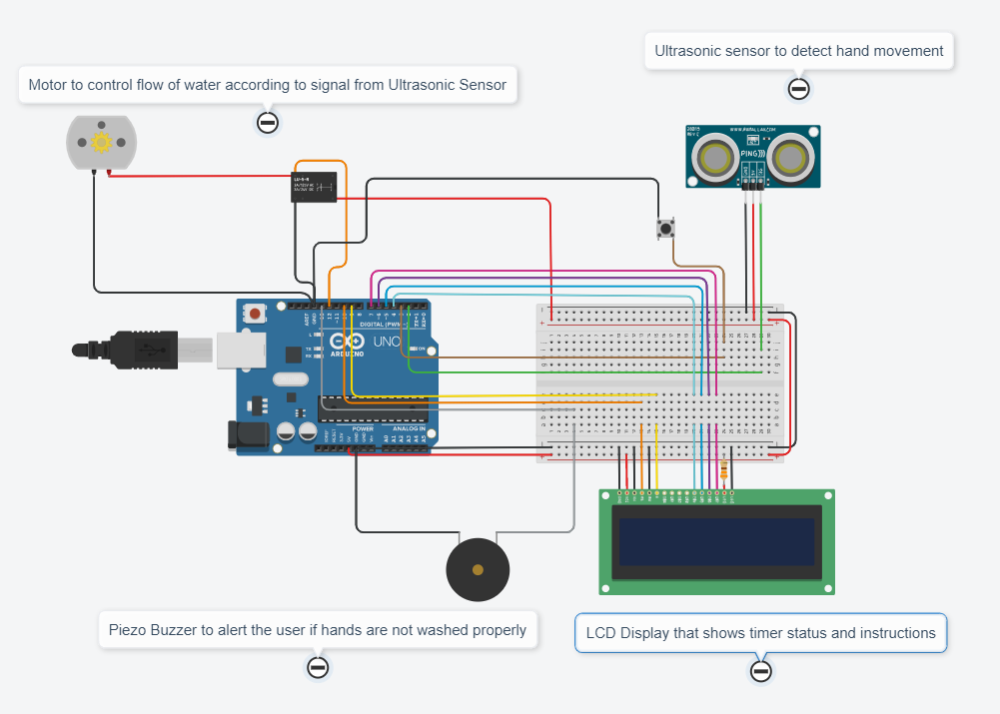

# Automated Arduino Handwash Circuit
## 👉[Tinkercad Link](https://www.tinkercad.com/things/l8VYBr4YLlm)
## A circuit made with Arduino UNO  that can be "installed" on your tap that can be used to control the water flow automatically on detection of hands using ultra sonic sensor. It'll notify you with a sound and a message on the display if you didn't wash your hands enough. There is also a button to restart the timer, if necessary. 

